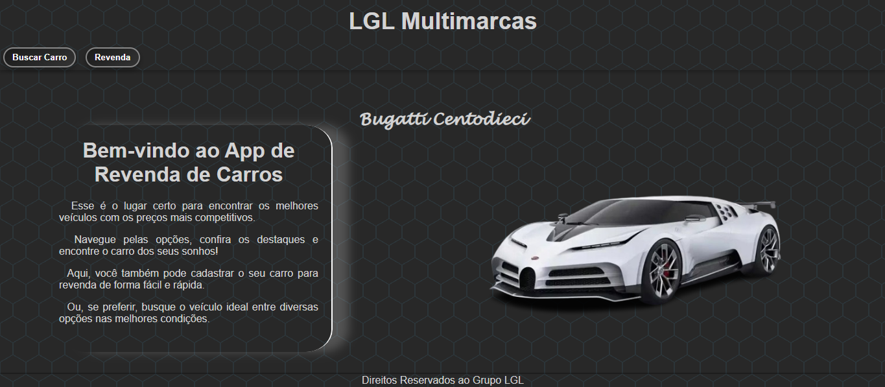

# Sistema de Revenda de Carros 🚗

Este é um projeto de aplicação web desenvolvido para facilitar o processo de compra, venda e busca por veículos. O sistema oferece uma interface intuitiva para cadastro, pesquisa e navegação entre diferentes modelos, ajudando compradores e vendedores a encontrar a melhor oportunidade no mercado automotivo.

## Funcionalidades Principais

- **Menu com Carrossel de Carros**  
  Um carrossel interativo que exibe os principais veículos em destaque, permitindo ao usuário navegar entre os modelos disponíveis.

- **Cadastro de Veículos para Revenda**  
  Uma tela simples e prática onde usuários podem cadastrar veículos para revenda, inserindo informações como modelo, ano, quilometragem e preço.

- **Busca de Veículos com Filtros**  
  Ferramenta de busca avançada que permite aos usuários filtrar os carros por critérios como modelo, faixa de preço, ano e muito mais.

- **Consulta FIPE a Partir da Placa**  
  Integração com uma API que realiza a busca de informações na Tabela FIPE a partir de uma placa existente, fornecendo dados de referência para o veículo.

---

## Tecnologias Utilizadas

### Frontend
- **HTML e CSS**: Estrutura e estilo para as telas da aplicação, com design responsivo e moderno.
- **JavaScript**: Lógica interativa e controle do carrossel e da busca de veículos.

### Bibliotecas e Pacotes
- **Axios**: Para consumo de APIs de forma eficiente e confiável.
- **Moment.js**: Manipulação e formatação de datas.

---

## Como Funciona a Aplicação

1. **Carrossel de Veículos**  
   Logo na tela inicial, os usuários encontram um carrossel que exibe carros em destaque, com informações básicas sobre cada modelo.

2. **Cadastro de Veículos**  
   Na tela de cadastro, vendedores podem adicionar seus carros ao sistema de forma fácil e rápida, preenchendo os dados necessários.

3. **Busca com Filtros Avançados**  
   A busca permite que os usuários filtrem os veículos disponíveis para encontrar o modelo ideal de acordo com suas preferências.

4. **Consulta FIPE pela Placa**  
   A aplicação utiliza uma API para buscar informações completas na Tabela FIPE de qualquer veículo cadastrado, fornecendo mais transparência e credibilidade.

   

## Revenda de Carros - Visualização no Celular

Este projeto de revenda de carros possui uma interface responsiva, adaptada para ser visualizada de forma eficiente em dispositivos móveis. Abaixo, você pode conferir algumas capturas de tela mostrando como o programa é exibido em um celular.

## Fotos do Programa Rodando no Celular

### 1. Menu Principal

### 2. Tela de Revenda

### 3. Tela de Revenda Completa

### 4. Tela de Busca de Carros

